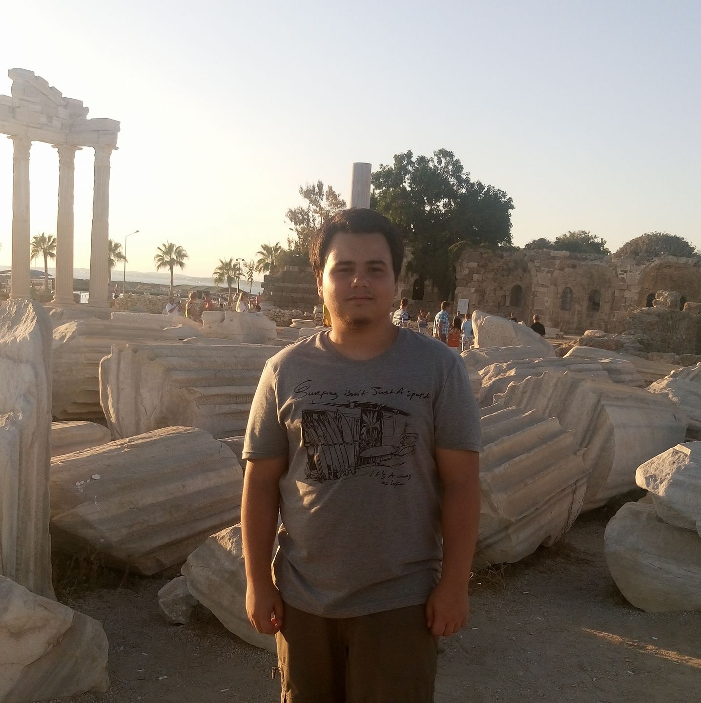

<h2>Hakkımda</h2> 

İstanbul Sabahattin Zaim Üniversitesi Bilgisayar Mühendisliği bölümünden mezun oldum. Ayrıca Anadolu Üniversitesi Açık Öğretim Fakültesinde Yönetim Bilişim Sistemleri okumaktayım. Bilge Adam Teknolojide İşkur destekli nitelikli bilişim uzmanlığı eğitimi kapsamında, Sistem ve Ağ Uzmanlığı eğitimi aldım bu eğitim 800 saat sürmüştür. Bu eğitim sürecinde MCSA ve MCSE sertifikalarını da alarak eğitimimi tamamladım. Eğitim içeriği Microsoft, Linux, SQL Server, Cisco CCNA, Azure, Office 365, Exchange Server, VMware ESXI, Veeam Backup & Replication gibi konuları kapsamaktadır. System & Network Engineer pozisyonlarına ilgi duymaktayım ve kariyerime bu alanda yön vermek istiyorum. Kendini sürekli geliştirmeye çalışan, araştırma yapmayı ve gündemde olan konuları inceleyip takip eden, çalışmayı seven ve çabuk öğrenme yapısındayım. 

 [](https://github.com/Emre2492)
 [](mailto:emrecan@emrecanbulbul.com)
 [](https://www.linkedin.com/in/emrecan-bulbul)

 
